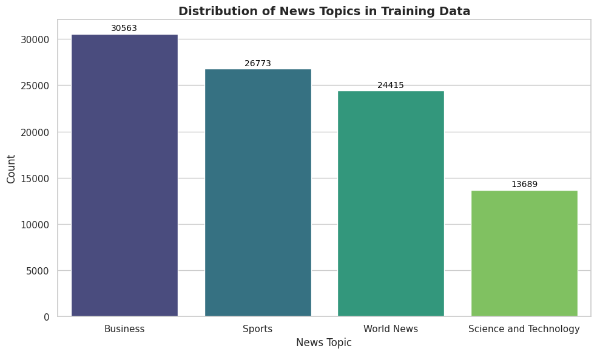
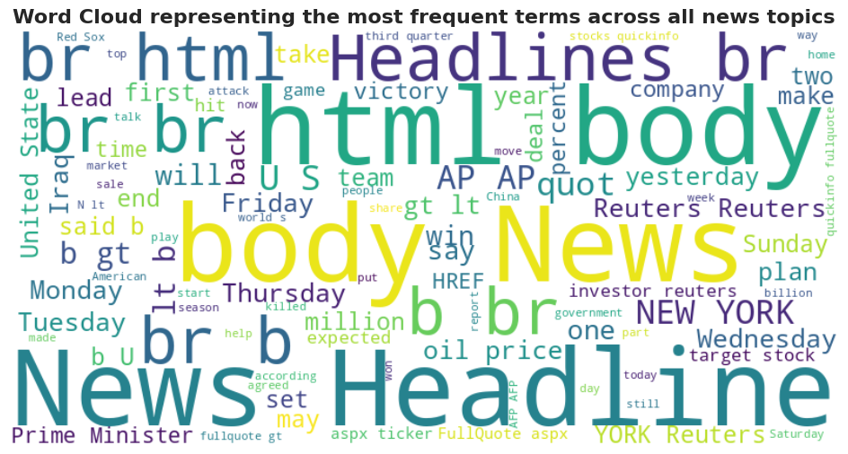
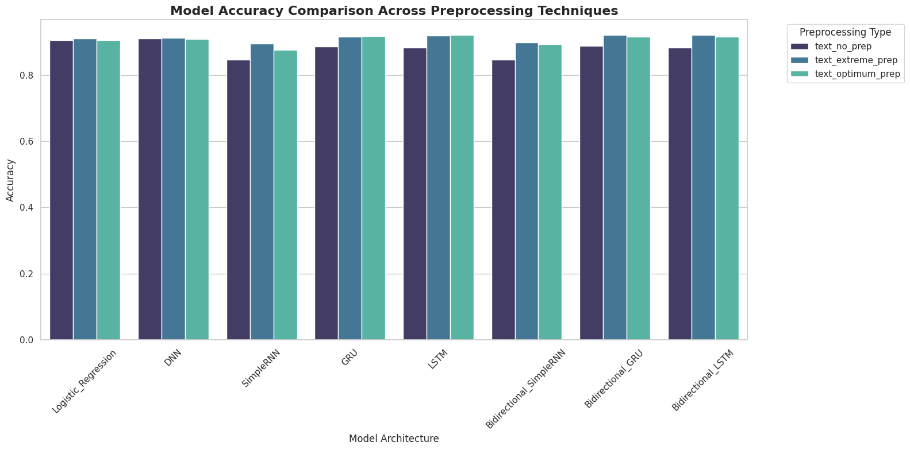
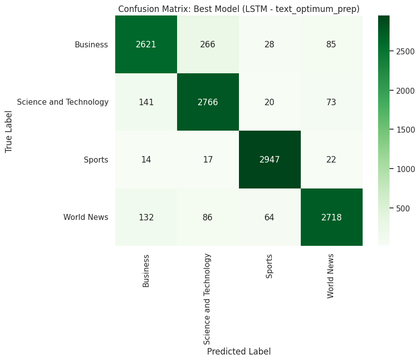

# Multi-Class Text Classification: A Comparative Analysis

This repository contains the source code and report for a comprehensive study on multi-class text classification using news headlines. The project investigates the impact of various text preprocessing strategies, word embedding techniques, and machine learning architectures on classification performance.

## Authors
- **Abdullah Al Mazid Zomader** - BRAC University
- **Masrur Sarar** - BRAC University
- **Abdullah Al Faisal** - BRAC University

---

## Abstract
Text classification is a fundamental task in Natural Language Processing (NLP). This project analyzes the classification of news headlines into four categories: **Business, Science and Technology, Sports, and World News**. We developed three distinct datasets representing zero, extreme, and optimum preprocessing levels, vectorized using **TF-IDF** and **Skip-gram (Word2Vec)**. We evaluated models ranging from **Logistic Regression** and **Deep Neural Networks (DNN)** to complex sequence models like **LSTM, GRU**, and their **Bidirectional** variants. Our results show that **LSTM** models with an "optimum" preprocessing strategy achieve the highest performance (92.1% accuracy).

---

## Dataset & EDA
The dataset consists of **107,440 news headlines**, with a training set of 95,440 and a test set of 12,000.

### Class Distribution
Initial EDA revealed a slight class imbalance, with Business news being the majority and Science/Technology being the minority.

### Frequent Terms
Frequent terms in the dataset often included scraping artifacts and publisher tags, which necessitated robust preprocessing.

---

## Methodology

### 1. Preprocessing Pipelines
- **No Preprocessing:** Raw data with HTML tags and punctuation.
- **Extreme Preprocessing:** Lowercasing, removal of HTML, URLs, punctuation, digits, and stopwords, followed by **Porter Stemming**.
- **Optimum Preprocessing:** Targeted HTML/artifact removal while preserving natural syntactic structure and stopwords.

### 2. Word Representations
- **TF-IDF:** Used for Logistic Regression and DNN (5,000 features).
- **Skip-gram (Word2Vec):** 100-dimensional dense embeddings trained on the corpus for sequence models.

---

## Model Architectures
We compared 24 unique configurations across the following models:
- **Baseline:** Logistic Regression (Multinomial)
- **Deep Learning:** Deep Neural Networks (DNN) with Dropout
- **Sequence Models:** SimpleRNN, GRU, LSTM
- **Bidirectional Models:** Bi-SimpleRNN, Bi-GRU, Bi-LSTM

---

## Experimental Results

The **LSTM model with Optimum Preprocessing** emerged as the top performer.

### Performance Comparison (Top 10)
| Rank | Dataset | Model | Accuracy | F1-Score |
| :--- | :--- | :--- | :--- | :--- |
| 1 | **Optimum** | **LSTM** | **0.9210** | **0.9209** |
| 2 | Extreme | Bidirectional LSTM | 0.9206 | 0.9204 |
| 3 | Extreme | Bidirectional GRU | 0.9205 | 0.9204 |
| 4 | Extreme | LSTM | 0.9188 | 0.9187 |
| 5 | Optimum | GRU | 0.9174 | 0.9173 |
| 6 | Optimum | Bidirectional GRU | 0.9159 | 0.9159 |
| 7 | Optimum | Bidirectional LSTM | 0.9154 | 0.9152 |
| 8 | Extreme | GRU | 0.9149 | 0.9147 |
| 9 | Extreme | DNN | 0.9130 | 0.9129 |
| 10 | Extreme | Logistic Regression | 0.9108 | 0.9106 |

### Confusion Matrix (Best Model)
The LSTM (Optimum) model showed exceptional precision, particularly in the Sports category.

---

## Conclusion
- **Preprocessing Matters:** "Optimum" preprocessing (cleaning without stemming) preserves syntactic cues vital for sequence models.
- **Gated Units are Superior:** LSTM and GRU consistently outperformed SimpleRNN and DNN.
- **Robust Baselines:** Logistic Regression remains highly competitive for short-text classification when noise is managed.

---

## Technologies Used
- **Language:** Python
- **Libraries:** NLTK, Scikit-learn, TensorFlow, Keras, Pandas, Matplotlib, WordCloud
- **Word Embeddings:** Word2Vec (Skip-gram), TF-IDF
